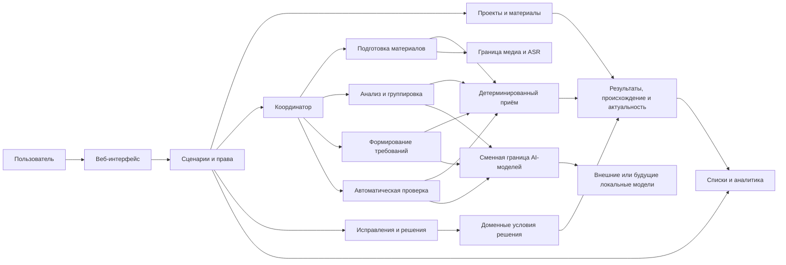
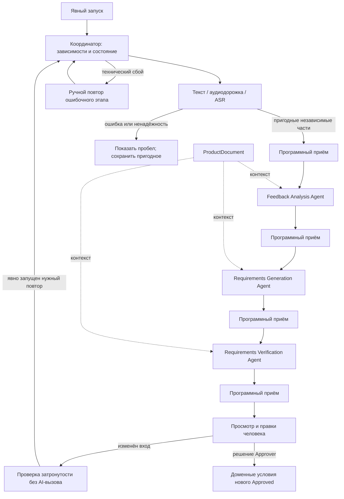

# Логическая архитектура feedback2req

**Статус: APPROVED / утверждено 2026-10-09 в пределах А1–А6.** Основание:
[DEC-003](DECISIONS.md); продуктовая baseline — `DEC-001` и `DEC-002`,
[предметная область](DOMAIN.md) и [требования](REQUIREMENTS.md). Утверждены
логические ответственности и взаимодействия, а не схема хранения, API,
технология, провайдер, число процессов или физическое размещение.

## 1. Контекст и граница решения

Пользователи работают с материалами и результатами только в доступных им
проектах. Входы: текстовая обратная связь, речь в аудио- и видеозаписях и
документация продукта. Из видео в MVP используется речь, а не изображение.
Результаты: находки и группы, проекты требований, автоматическая проверка,
человеческие решения и аналитика. Эта логическая схема не вводит обязательных
внешних интеграций.
Внешние AI-сервисы допустимы по `NFR-004`, но провайдер не выбран; логическая
граница допускает замену провайдера или будущий локальный компонент.

Приложение имеет модульную организацию. Модуль — граница ответственности,
а не требование отдельного сервиса. Длительная обработка выполняется в фоне
после явного запуска пользователем; загрузка сама по себе не запускает полный
анализ. Способ фонового исполнения и размещения остаётся открытым.

## 2. Логические компоненты

| Компонент | Ответственность и граница |
|---|---|
| Веб-интерфейс | Загрузка, запуск и ручной повтор, состояние этапов и частей, просмотр основания и области охвата, исправления, решения и предупреждения перед удалением. Скрытие действия в интерфейсе не заменяет проверку прав. |
| Прикладные сценарии и права | Выполняют команды пользователя, проверяют доступ к `Project` и полномочия для каждой операции; исключают использование данных другого проекта как контекста. |
| Проекты и материалы | Управляют составом проекта, `FeedbackSource` и `ProductDocument`, доступом к ним и согласованными действиями удаления. |
| Координатор обработки | Управляет последовательностью, зависимостями, состоянием выполнения, передачей результатов, фоновыми запусками и ручными повторами. Не содержит предметных правил, содержательной AI-проверки или полномочий человеческого решения. |
| Подготовка материалов | Получает текст или речь из материала, сопоставляет транскрипт с доступной записью и обозначает ненадёжные участки. Изображение видео не анализирует. |
| Анализ и группировка | Роль `Feedback Analysis Agent`: выделяет фрагменты, находки и группы, сохраняя прямые слова, интерпретации, отдельные и конфликтующие позиции. |
| Формирование требований | Роль `Requirements Generation Agent`: готовит проекты `Requirement` из находок с путём к обратной связи; `ProductDocument` использует как контекст. |
| Автоматическая проверка | Роль `Requirements Verification Agent`: возвращает `VerificationResult` с замечаниями, серьёзностью, блокирующим действием и вопросами; не утверждает требование. |
| Детерминированный приём результата | В прикладном слое проверяет структуру AI-кандидата и программно проверяемые доменные ограничения до его использования и передачи дальше. Не устанавливает смысловую достаточность и не является AI-агентом. |
| Исправления и решения человека | Сохраняют человеческие правки отдельно от AI-выводов, ведут `RequirementChangeProposal` и проверяют условия нового решения `Approver`. |
| Происхождение и актуальность | Поддерживают путь к входам, историю, область охвата, доступность и достаточность оснований, актуальность проверки и состояние обработки; не задают физическую схему. |
| Представление и аналитика | Показывают результат с неполнотой и состоянием оснований; не считают предложение вторым действующим требованием или материалы числом независимых участников. |

Граница AI получает только разрешённый контекст соответствующего проекта.
Логические модули и внешние границы не задают число процессов, очередь,
протокол или библиотеку.

## 3. Координация и приём результатов

Координатор вызывает применимые этапы и приём результата, но не владеет
правилами этого приёма. Состояние ведётся по этапам и независимо
обрабатываемым пригодным частям. Размер части и алгоритм сегментации не
выбраны. Независимость означает, что ошибочная часть не требуется для вывода
из другой пригодной части; в сомнительном случае неполнота обозначается.

До включения AI-кандидата в текущие предметные результаты прикладной приём
проверяет ожидаемую структуру, обязательные связи, существование и проектную
принадлежность ссылок, доступность источника, актуальность входа и программно
проверяемые инварианты. Кандидат не может напрямую заменить действующее
`Approved`, использовать `ProductDocument` как единственное основание новой
потребности или объявить удалённый фрагмент доступным. Невалидный кандидат
не передаётся следующему предметному этапу; ошибка этапа видна пользователю.
Объём технической диагностики, включая сырой ответ, определяется позднее.

Содержательная связь вывода с отзывом, достаточность основания, противоречия
и неоднозначность оцениваются соответствующей AI-ролью и человеком.
`VerificationResult` отделён от человеческого решения. Перед новым решением
`Approved` проверяются право `Approver`, проверка рассматриваемой редакции,
наличие пригодного доступного основания в обратной связи и отсутствие
открытого блокера или неразрешённого существенного вопроса. Доступная ссылка
сама по себе не доказывает смысловую достаточность; окончательное решение
принимает человек после просмотра оснований.

## 4. AI-workflow и частичная обработка

Каждая роль возвращает кандидат результата, а не команду другой роли или
человеческое решение. Подробные границы описаны в
[архитектуре продуктовых агентов](AGENT_ARCHITECTURE.md). Центральная
координация позволяет отдельно проверять роли; автономное взаимодействие
агентов и агентный фреймворк не требуются для утверждённого MVP. Такой подход
поддерживает исследование вклада ролей, но сам по себе не исследует
автономное планирование или переговоры агентов.

Успешные независимые результаты сохраняются при сбое другой части или этапа.
Зависимые от ошибки выводы не выдаются за завершённые. Для результата
показывается область охвата: частичный анализ не представляется как анализ
всего материала или проекта. Ненадёжное распознавание отличается от
технической ошибки.

## 5. Повторы, зависимости и актуальность

| Действие | Условие | Логическое следствие |
|---|---|---|
| Технический повтор | Этап завершился ошибкой, вход не изменился. | `ProjectMember` вручную повторяет ошибочный этап; успешные независимые результаты остаются, затронутые потомки нового выхода проверяются. |
| Проверка актуальности | Изменён вход или использованный контекст, исправлен результат либо удалён источник. | Без AI-вызова определяются затронутые зависимости и отмечается необходимость актуализации; не каждая правка запускает AI. |
| Повторная содержательная проверка | Изменены основание, текст требования или причина замечания. | Проверяется затронутый вывод или предложение; полный независимый анализ не обязателен. Требующий AI этап запускается в явно начатом процессе. |
| Повторное формирование | Изменение находки, группы или основания может изменить требование. | Создаётся новый кандидат для затронутой ветви с последующей проверкой; действующее `Approved` и человеческая правка не заменяются автоматически. |

Зависимости прослеживаются от `FeedbackSource` через доступный текст или
`Transcript`, `FeedbackFragment`, `Finding` и `FindingGroup` к `Requirement`
или `RequirementChangeProposal` и его `VerificationResult`. Одна находка может
привести к нескольким требованиям, а требование — зависеть от нескольких
находок. `ProductDocument` является отдельной контекстной зависимостью.
Если влияние изменения нельзя уверенно ограничить, затронутый вывод явно
требует актуализации. Критерий существенности правки уточняется позже.

Новый AI-результат может стать текущим в своей области охвата только при
актуальных входах, существующем проекте и необходимых источниках, успешном
программном приёме и явном обозначении неполноты или неопределённости.
Поздно завершившаяся задача не публикует результат по удалённому или
изменённому входу как текущий. После человеческой правки новый AI-вывод
остаётся отдельным кандидатом до явного выбора человеком.

«Текущий результат обработки» не тождественен действующей утверждённой
редакции. После утраты источника неизменённая редакция сохраняет человеческое
решение `Approved`, а доступность, достаточность оснований и актуальность
проверки показываются отдельно. Для нового `Approved` требуется пригодное
доступное основание и проверка рассматриваемой редакции.

## 6. Удаление, права и представления

Права проверяются при действиях приложения и обращениях к данным; регистрация
не открывает чужой проект. `ProjectMember` работает с доступными материалами
и неутверждёнными результатами, `Approver` принимает решения, `ProjectOwner`
управляет доступом и удаляет источник или проект. В MVP на утверждённое
требование допускается не более одного незавершённого предложения изменения;
это ограничение MVP, а не неизменный доменный инвариант.

Перед удалением источника `ProjectOwner` получает предупреждение: файл,
транскрипт и содержимое сохранённых фрагментов удаляются, но производные
результаты и история могут содержать пересказы и отдельные цитаты; удаление
у внешнего AI-провайдера не гарантируется. Выполняющаяся задача не может
восстановить удалённое содержимое. Историческая связь не считается доступным
подтверждением. Если остались другие основания, их достаточность проверяется
либо явно ожидает актуализации.

Удаление проекта после явного подтверждения `ProjectOwner` прекращает доступ
к его материалам, результатам, требованиям, решениям и происхождению в
приложении; выполняющиеся задачи не восстанавливают проектные данные.
Глобальная учётная запись остаётся. Сроки и технические механизмы очистки
временных данных, журналов и копий определяются отдельно.

Представления показывают человеческое решение отдельно от `VerificationResult`,
доступности и достаточности оснований. Среди `Approved` видна частичная или
полная утрата подтверждения; ожидающее предложение не считается вторым
действующим требованием. Количество материалов, фрагментов, находок и
упоминаний не выдаётся за число уникальных участников или независимых
подтверждений.

## 7. Рассмотренные организационные варианты

| Вариант | Вывод для MVP |
|---|---|
| Модульное приложение с центральной координацией — утверждено | Управляет зависимостями, повторами, частичной обработкой и актуальностью без обязательной распределённой инфраструктуры; границы ролей остаются проверяемыми. |
| Прямые взаимные вызовы автономных AI-компонентов | Разносят состояние и правила повтора между ролями; усложняют происхождение и человеческий контроль без утверждённой необходимости. |
| Отдельный сервис для каждого этапа или агента | Усложняет согласованное удаление, обработку ошибок и эксплуатацию небольшого прототипа; оснований по нагрузке пока нет. |
| Один синхронный полный запуск | Не соответствует утверждённым фоновому выполнению, частичным результатам и ручному повтору. |

Организационный выбор не утверждает число процессов, очередь или развёртывание.

## 8. Соответствие продуктовой baseline

| Архитектурная область | Бизнес-правила и требования | Критерии |
|---|---|---|
| Проекты, права, контекст и удаление | `BR-001`, `BR-016`, `BR-017`; `FR-001`–`FR-003`, `FR-031`–`FR-033`, `NFR-003`, `NFR-004` | `AC-01`, `AC-10`, `AC-11` |
| Подготовка, частичная обработка и координация | `BR-002`, `BR-010`, `BR-012`; `FR-004`–`FR-007`, `FR-023`, `NFR-001` | `AC-02`, `AC-07` |
| Анализ и группировка | `BR-004`–`BR-006`; `FR-008`–`FR-013` | `AC-03`, `AC-04` |
| Формирование и контекст документа | `BR-007`–`BR-009`; `FR-014`–`FR-017` | `AC-05` |
| AI-проверка и детерминированный приём | `BR-011`, `BR-013`; `FR-018`–`FR-020`, `FR-025` | `AC-06`, `AC-08` |
| Исправления, предложения и решения | `BR-003`, `BR-012`–`BR-016`; `FR-021`–`FR-027`, `FR-032` | `AC-07`, `AC-08` |
| Происхождение, актуальность и аналитика | `BR-003`, `BR-006`, `BR-009`, `BR-015`; `FR-015`, `FR-016`, `FR-028`–`FR-031`, `NFR-002`, `NFR-003` | `AC-05`, `AC-07`, `AC-09`, `AC-10` |

Шесть инвариантов [AI_VALIDATION.md](AI_VALIDATION.md) сохраняются. Методика,
численные метрики и пороги AI-оценки этим решением не задаются.

## 9. Граница следующего этапа

Отдельного предложения и утверждения требуют подробная модель данных и
ревизий, точные контракты AI-компонентов, API, технологический стек,
физическое размещение, механизмы фонового исполнения, хранения и удаления.
Гранулярность частей, критерий существенности правки, форматы и лимиты,
нагрузка и AI-метрики не блокируют логические границы и здесь не установлены.
