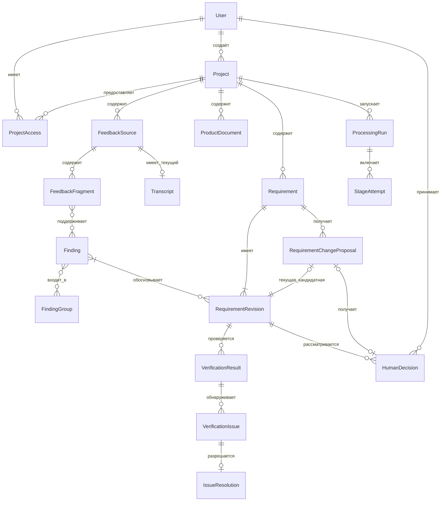

# Логическая модель данных feedback2req

**Статус: APPROVED / утверждено 2026-10-09 в пределах ДМ-1–ДМ-6.** Основание: [DEC-004](DECISIONS.md); продуктовые правила — `DEC-001` и `DEC-002`, логическая архитектура — `DEC-003`. Эта модель задаёт смысл данных и ограничения целостности. Она не задаёт физическую схему БД, способ хранения версий, формат идентификаторов, API, механизм фоновой обработки или технологический стек.

## 1. Границы и виды объектов

Предметные объекты описывают проект, материалы, выводы, формулировки требований, проверки и решения человека. Технические объекты `ProcessingRun` и `StageAttempt` описывают выполнение обработки; их состояние не является статусом требования. Связи происхождения, контекста и зависимости являются логическими отношениями между объектами; отдельная универсальная сущность для каждого ребра не требуется.

| Объект | Назначение | Существенные концептуальные данные |
|---|---|---|
| Пользователь (`User`) | Локальная учётная запись человека. | Устойчивая идентичность; не принадлежит одному проекту. |
| Проект (`Project`) | Граница совместной работы и изоляции данных. | Идентичность, создатель `ProjectOwner`, состояние существования. |
| Доступ к проекту (`ProjectAccess`) | Связь `User` с конкретным `Project` и его полномочиями. | Пользователь, проект, участие `ProjectMember`, дополнительное право `Approver`; права владельца следуют из создания проекта. |
| Источник отзыва (`FeedbackSource`) | Исходный текстовый, аудио- или видеоматериал обратной связи. | Идентичность, проект, вид материала, наличие исходного содержимого, факт удаления. После удаления историческая связь хранит только технический идентификатор и факт удаления. |
| Транскрипт (`Transcript`) | Текст речи из доступной записи. | Источник, сопоставление с записью, доступный текст и отметки ненадёжности, различимые AI-результат и правка человека. |
| Фрагмент отзыва (`FeedbackFragment`) | Проверяемая часть исходного отзыва. | Источник, содержимое и место в доступном материале, отметка ненадёжности, история AI-выделения и человеческих исправлений. |
| Документ продукта (`ProductDocument`) | Контекст для анализа и проверки. | Проект, доступное содержимое и использованное состояние документа; не является самостоятельным основанием потребности. |
| Находка (`Finding`) | Отдельный вывод об отзыве. | Смысловые характеристики, прямая речь или интерпретация, неопределённость, поддерживающие фрагменты, фактический охват, происхождение и история правок. |
| Группа находок (`FindingGroup`) | Смысловая группировка без потери отдельных позиций. | Состав находок, конфликтующие позиции, область рассмотренных находок, происхождение и история правок. |
| Требование (`Requirement`) | Устойчивая идентичность предлагаемой доработки. | Проект, сохранённые редакции, действующая редакция и человеческое решение, если оно принято; ожидающее предложение не является вторым действующим требованием. |
| Редакция требования (`RequirementRevision`) | Неизменяемое сохранённое содержательное состояние требования. | Формулировка, выбранные поддерживающие `Finding` и путь к основаниям, конкретные состояния этих оснований, отдельно использованный контекст, происхождение формулировки и охват. |
| Предложение изменения (`RequirementChangeProposal`) | Отдельная кандидатная редакция ранее утверждённого требования. | Требование, автор, предлагаемая редакция, состояние рассмотрения и решение; действующее `Approved` до решения не заменяет. |
| Результат проверки (`VerificationResult`) | Вывод одного выполнения автоматической содержательной проверки. | Точная `RequirementRevision` и состояния входов, рассмотренные основания и контекст, фактический охват, замечания и вопросы, связь с целевым повтором, актуальность. Не является решением `Approver`. |
| Замечание проверки (`VerificationIssue`) | Одно обнаружение в конкретном `VerificationResult`. | Содержание и причина, серьёзность, блокирующее действие, вопрос человеку; собственная идентичность в истории проверок. |
| Разрешение замечания (`IssueResolution`) | Явная запись о разрешении конкретного обнаружения. | Замечание, способ и обоснование, ответственный пользователь, время, при исправлении причины — связь с проверкой затронутого вывода. Исходное замечание сохраняется. |
| Решение человека (`HumanDecision`) | Решение `Approver` по определённой редакции или предложению. | Автор и время, вид решения, точная `RequirementRevision`, рассмотренные состояния оснований и проверки, при необходимости связь с `RequirementChangeProposal`. |
| Запуск обработки (`ProcessingRun`) | Техническая запись о явно начатой обработке или повторе. | Проект, инициатор, запрошенная область материалов или их частей и этапы, входные состояния, общее состояние выполнения. |
| Попытка этапа (`StageAttempt`) | Техническая запись об одном выполнении этапа. | Этап, входные состояния, запрошенные и фактически рассмотренные части, исход каждой части, принятые выходы, ошибка или недостаточная надёжность, связь с повтором. |

`FeedbackParticipant` остаётся понятием предметной области, но его программная идентичность, объединение записей и подсчёт независимых людей в MVP не требуются. `Problem`, `Request`, `Observation` и `Need` — смысловые характеристики `Finding`, а не обязательные отдельные сущности.

## 2. Связи и кардинальности

Один `Project` имеет ровно одного создателя; у `User` может быть несколько проектов и прав доступа. Каждый проектный материал и результат принадлежит одному проекту. Для источника речи может существовать один текущий `Transcript`; сохранённые состояния и правки транскрипта описываются историей, а не кардинальностью текущего представления.

Один `Finding` может поддерживаться несколькими `FeedbackFragment` и одновременно входить в несколько `FindingGroup`; каждая группа сохраняет состав и отдельные конфликтующие позиции. При создании находка опирается хотя бы на один фрагмент. После удаления источника доступных фрагментов может не остаться, поэтому диаграмма допускает ноль текущих связей с `FeedbackFragment`, а историческое происхождение сохраняется по правилу раздела 6. В общей аналитике находка считается один раз по собственной идентичности. Одна находка может поддерживать несколько редакций требований, а каждая редакция опирается хотя бы на одну находку. Каждая содержательная редакция принадлежит ровно одному `Requirement`; сохранённое предложение изменения указывает ровно на одну текущую кандидатную редакцию. Если она исправлена, прежняя редакция остаётся в истории того же требования, а текущий указатель предложения переходит к новой редакции. Это не вводит отдельный многовариантный сценарий согласования. В MVP допускается не более одного **незавершённого** предложения на одно утверждённое требование; завершённых предложений в истории может быть несколько.

Каждый `VerificationResult` относится к одной точной редакции, а редакция может проверяться неоднократно. Замечание принадлежит одному результату проверки; разрешение относится к одному замечанию. `HumanDecision` относится к одной редакции; решение по предложению дополнительно связано с этим предложением. Логические контекстные зависимости от `ProductDocument` и входные зависимости технических попыток не показаны в ER-диаграмме как отдельные сущности. Они фиксируют конкретные использованные состояния и не превращают документацию в основание пользовательской потребности.

Все предметные ссылки в результате, проверке, предложении и решении должны относиться к тому же `Project`. Для новой редакции требования нужен хотя бы один поддерживающий `Finding` с путём к пользовательской обратной связи; для нового `Approved` этот путь должен вести к пригодному доступному основанию. `ProductDocument` не подменяет такой путь. Владелец проекта имеет полномочия `ProjectMember` и `Approver` по умолчанию; `HumanDecision` допустимо только при наличии права `Approver` в данном проекте на момент решения.

## 3. Идентичность, сохранённые состояния и история

Идентичность `Requirement` переживает смену редакций. Каждая **сохранённая содержательная** `RequirementRevision` неизменяема с момента сохранения: её формулировка, выбранный набор оснований и указание состояний этих оснований не переписываются. Изменение текста либо выбранного набора оснований создаёт новую редакцию; несохранённое редактирование формы не образует редакцию. Позднейшее исправление исходной находки или фрагмента не переписывает прежнюю редакцию: оно влияет на актуальность зависимых результатов. Чтобы использовать исправленное основание в новом решении, создают новую редакцию.

`VerificationResult` фиксирует точную редакцию и входные состояния, которые проверялись; `HumanDecision` фиксирует точную редакцию, рассмотренные основания и относящуюся к ней проверку. Проверка и решение прежней редакции не переносятся на новую. Логическая воспроизводимость означает возможность установить, **какое состояние** входа было рассмотрено, а не обязательное копирование содержимого всех исходных файлов в каждую редакцию. После удаления источника его содержимое нельзя восстановить только ради исторической проверки; сохраняется факт прежней связи и утраты доступа.

Для `Transcript`, `FeedbackFragment`, `Finding`, `FindingGroup` и других исправляемых результатов история различает принятый AI-вывод, исправление человека, автора и время значимого изменения и выбранное текущее состояние. Предыдущие содержательные состояния, на которые ссылаются результаты проверки или решения, должны быть различимы с учётом утверждённых правил удаления исходного содержимого. Это логическое ограничение не задаёт универсальный журнал событий либо физическое копирование каждого объекта.

`VerificationIssue` является обнаружением конкретной проверки. Целевой повтор `VerificationResult` может ссылаться на прежнюю проверку или вызвавшее повтор замечание; новая проверка создаёт собственные обнаружения без автоматического отождествления с прежними. Прежнее разрешение «неприменимо» не закрывает новое замечание. Старое открытое блокирующее замечание остаётся видимым до явного разрешения с сохранением причины и истории; отсутствие такого замечания в новом ответе AI не разрешает его само по себе. После исправления причины фиксируется проверка затронутого вывода. Только `Approver` вправе признать замечание неприменимым с обоснованием; принятие риска не является разрешением блокера. Права на остальные действия по исправлению не расширяются этой моделью.

## 4. Происхождение, зависимости и актуальность

Для доступных материалов проверяемый путь идёт от `FeedbackSource` через `FeedbackFragment` к `Finding` и далее к `RequirementRevision`; `Transcript` связывает речь с местом в доступной записи. `FindingGroup` показывает состав и охват группировки, но не заменяет отдельные находки. Выбранные поддерживающие связи и контекстные зависимости различаются: `ProductDocument` используется для интерпретации и проверки, но не является самостоятельным подтверждением потребности.

Производный результат логически хранит идентичности и состояния входов, от которых зависит его содержание: материалы и фрагменты, принятые находки или группы, рассматриваемую редакцию и использованный контекст документации. Связь с `ProcessingRun` и `StageAttempt` объясняет происхождение AI-вывода и область выполнения. Изменение входа, человеческая правка или удаление источника позволяет определить затронутые результаты без автоматического полного AI-повтора. Если влияние нельзя надёжно ограничить, соответствующий результат явно требует актуализации. Технический повтор сбоя, проверка актуальности без AI, повторная содержательная проверка и новое формирование зависимых результатов остаются разными действиями.

AI-кандидат становится текущим предметным результатом только после детерминированного приёма структуры, ссылок, проектной принадлежности и программно проверяемых ограничений, при актуальных входах и существующих нужных материалах. Поздний выход по изменённому или удалённому входу не публикуется как текущий и не восстанавливает удалённые данные. Новый AI-вывод после человеческой правки не заменяет её незаметно. Смысловую достаточность основания определяют содержательная проверка и человек, а не сам факт существования ссылки.

Человеческое решение (`Draft`, `Approved`, `Rejected` как предварительные названия), состояние выполнения, актуальность проверки и доступность/достаточность оснований являются независимыми аспектами. Утрата источника не отменяет прежнее `Approved` по неизменённой редакции. Текущее подтверждение может быть полностью доступным, частично утраченным или недоступным; достаточность оставшегося материала проверяется либо явно ожидает актуализации. Для **нового** `Approved` нужны проверка рассматриваемой редакции, пригодное доступное основание и отсутствие открытого блокера или неразрешённого существенного вопроса.

## 5. Запрошенная и фактическая область обработки

`ProcessingRun` фиксирует запрошенную область обработки: материалы целиком либо их логические части, а также нужные этапы. Это не требует отдельного выбора частей пользователем в интерфейсе. `StageAttempt` для применимого этапа различает запрошенные, фактически рассмотренные, успешно и пригодно обработанные, ненадёжно обработанные, завершившиеся ошибкой и ещё ожидающие части. Ошибка и недостаточная надёжность различаются. Размер части, способ её выделения и техническое представление набора частей здесь не задаются.

Каждый принятый производный результат указывает фактически **рассмотренную область** и отдельно **область поддерживающих оснований**. Для `Finding` это связанные части материала; для `FindingGroup` — рассмотренный набор находок и их область; для `RequirementRevision` — рассмотренные при формировании находки и выбранные поддерживающие основания. Человеческое исправление сохраняет связь с изменённым результатом и его фактическим охватом. Результат группировки или формирования, основанный лишь на части пригодных данных, не объявляется итогом всего материала либо проекта.

Полнота обработки определяется относительно запрошенной области и необходимых этапов, а не числом обнаруженных находок: успешная часть может не содержать находок. Результаты независимых пригодных частей сохраняются при сбое другой части. Недостаточная надёжность части не становится основанием уверенного вывода, если от неё зависит существенная часть смысла. Неполный охват сам по себе не запрещает новое утверждение требования, поддержанного хотя бы одним пригодным доступным отзывом; неполнота при этом видна пользователю.

## 6. Удаление и границы хранения

После явного предупреждения `ProjectOwner` может удалить `FeedbackSource`. Удаляются исходное содержимое, `Transcript` и содержимое сохранённых `FeedbackFragment` этого источника. Связи к удалённым фрагментам больше не дают открыть свидетельство; их текст, положение в источнике и временные интервалы не сохраняются как атрибуты исторической связи. Для сохранившегося производного результата историческая связь с удалённым источником содержит только его технический идентификатор и факт удаления. Ранее зафиксированное решение остаётся связанным с утраченным основанием, но его содержимое нельзя восстановить через эту ссылку или считать доступным подтверждением. `Finding`, `FindingGroup`, требования и история могут сохранить пересказы и отдельные цитаты согласно утверждённому правилу; такие производные сведения не превращаются в доступный исходный фрагмент. При утрате одного из нескольких источников оставшиеся доступные основания показываются отдельно; их достаточность проверяется либо результат явно требует актуализации. Удаление источника не означает удаления данных у внешнего AI-провайдера.

Удаление `Project` после явного подтверждения `ProjectOwner` удаляет в приложении его материалы, результаты обработки, требования, решения и историю происхождения. Связанные `ProcessingRun` и `StageAttempt` после удаления недоступны как данные или история проекта в приложении и не могут использоваться для публикации либо восстановления результатов; технический порядок их очистки определяется отдельно вместе с порядком очистки журналов. Глобальная учётная запись `User` сохраняется. Незавершённая обработка не может позднее восстановить удалённый проект или его результаты. Сроки и порядок очистки временных файлов, технических журналов и резервных копий, а также хранение данных внешним провайдером определяются отдельно; эта модель не обещает их автоматического удаления.

## 7. Проверка согласованности и трассируемость

| Область модели | Основание |
|---|---|
| Проектная принадлежность, права, удаление проекта | `BR-001`, `BR-016`, `BR-017`; `FR-032`, `FR-033`; `AC-01`, `AC-11`; А1, А5–А6 |
| Фрагменты, находки, группы и контекст документа | `BR-003`–`BR-009`; `FR-008`–`FR-017`; `AC-03`–`AC-05`; А3, А5 |
| Редакция, предложение изменения и решение | `BR-011`, `BR-013`, `BR-014`; `FR-018`, `FR-024`–`FR-027`; `AC-06`, `AC-08`; А3–А5 |
| Замечания и их разрешение | `BR-011`, `BR-013`; `FR-019`, `FR-025`; `AC-06`, `AC-08`; А3–А5 |
| Актуальность, частичная обработка и повтор | `BR-010`, `BR-012`; `FR-007`, `FR-023`; `AC-02`, `AC-07`; А2, А4–А6 |
| Происхождение и утрата источника | `BR-003`, `BR-009`, `BR-015`; `FR-015`, `FR-021`, `FR-028`–`FR-031`; `AC-05`, `AC-07`, `AC-09`, `AC-10`; А5–А6 |

Модель сохраняет [шесть инвариантов AI](AI_VALIDATION.md#инварианты-проекта) и не меняет обязанности трёх ролей из [AGENT_ARCHITECTURE.md](AGENT_ARCHITECTURE.md). Адресные редакции, решения и типизированные связи достаточны для MVP: единый event sourcing, универсальный граф объектов и автоматическое сопоставление повторных замечаний не требуются.

## 8. Вопросы следующих этапов

Технические формы идентификаторов, истории и ссылок на состояния входов, способ представления наборов частей, физическая схема, СУБД, ORM, механизм фоновой обработки, детальные контракты трёх AI-компонентов и API здесь не выбираются. Отдельно остаются критерий существенности правки, технические сроки и порядок очистки временных данных и копий, подробные состояния за пределами MVP и методика AI-оценки. Эти вопросы не меняют утверждённые ДМ-1–ДМ-6 без отдельного согласования.
